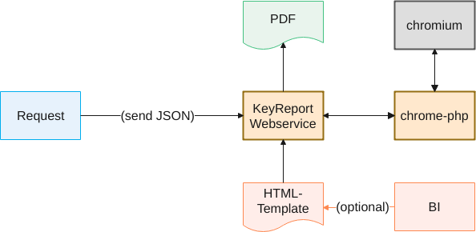

# KeyReport

KeyReport is a PHP-webservice creating PDFs by using headles chrome's save-to-pdf function. It was more a proof of concept, but we use it with a couple of applications in production. It is possible to convert any Webpage and using simple or more complex HTML-Pages as a template. 

The communication with the local headless chrome instance is done by the library [php-chrome](https://github.com/chrome-php/chrome), so chromium / chrome >= version 64 has to be installed on the host.



## Installation on Debian

The webservice requires a local webserver with PHP and chromium / chrome on the same host. As you may deploy it for testing to your local development host, this readme is based on this environment.

### Security

As it is a proof of concept, the project does not have any security like authentication. If you publish it to a public environment, kept it in mind. We use it exclusive in secure and private environments.

### Dependencies

```console
$ apt-get install chromium apache2 php php-xml libapache2-mod-php php-opcache php-mbstring php-cli php-curl php-gd php-json php-bz2 composer
```

On Debian the binary of chromium is 'chromium', on ubuntu it's 'chromium-browser'. You have to set the binary-name in the File KeyReport.php around line 109:

```php
# debian
$this->browserFactory = new BrowserFactory('chromium');

# ubuntu
$this->browserFactory = new BrowserFactory('chromium-browser');

```

### Webservice
The webservice contains the function to convert a page to PDF. Clone the repository to the webroot and install the dependencies with composer.

```console
$ cd /var/www/html
$ git clone https://github.com/rnick/KeyReport.git

$ cd KeyReport
$ composer install
```

Give write access to directory log and data

```console
$ chown www-data ./log ./data
$ chmod u+w ./log ./data
```

### Create template
The template is the webpage which is loaded by the webservice to convert to pdf. You can use the demo-template KeyReport-Demo-Template from https://github.com/rnick/KeyReport-Demo-Template as a test. So clone it to the webroot.

It contains a html-page and a webform that submits some parameters to the template, and finaly downloads the PDF.

```console
$ cd /var/www/html
$ git clone https://github.com/rnick/KeyReport-Demo-Template.git ./demotpl

$ cd demotpl
$ composer install
```

## Demo
http://www.ralf-nickel.de/demo/report/tpl/urkunde/demo.html

## Real-life Use-cases

-tbd
